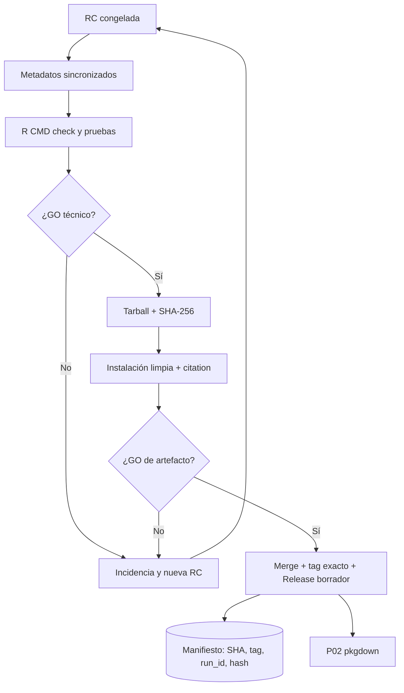

# P01 — Desarrollo y publicación del paquete renoe

**ID estable:** `P01``n`n**Estado:** candidato operativo
**Propietario documental:** mantenedora de renoe

## Propósito y alcance

Convertir cambios aprobados de código y metadatos en una versión instalable, etiquetada y auditable. Incluye la RC, el tarball, el tag y el GitHub Release; excluye pkgdown, Shiny y activos de datos.

## Usuario y responsable

Mantenedora del paquete y revisión técnica. La responsable de versión decide GO; la responsable de publicación no puede omitir una compuerta fallida.

## Entrada canónica y productor

Rama candidata y `DESCRIPTION` como versión canónica; producen los cambios las personas responsables de código. Véase el [manual de publicación](../MANUAL_PUBLICACION.md).

## Pasos y decisiones

1. Congelar RC y sincronizar metadatos. 2. Ejecutar pruebas, R CMD check y build. 3. Instalar tarball limpio. 4. Fusionar, etiquetar el SHA exacto y preparar Release borrador. 5. Esperar P02 y cerrar sólo tras verificar web y cita.

## Salidas y consumidores

Tarball, SHA-256, tag y Release. Consumen P02 y los equipos de P03–P08.

## Escenarios y perfiles aplicables

Versión estable o hotfix. Los escenarios analíticos no alteran el número de versión; se documentan en NEWS y viñetas.

## Controles y compuertas GO/NO-GO

GO sólo con `R-CMD-check` y `pkgdown-release-gate` verdes, tarball instalable y cita correcta. NO-GO ante cualquier versión discrepante, hash ausente o evidencia incompleta.

## Trazabilidad mínima

Versión, SHA RC, tag, run IDs, nombre/hash del tarball, URL del borrador y responsables.

## Dependencias y regla de invalidación descendente

Depende de cambios aprobados. Un cambio después de RC invalida build, hash, tag propuesto, P02 y cualquier consumidor que declare esa versión.

## Reanudación y rollback

Reanudar desde la primera compuerta sin evidencia. Si el Release ya es público, no mover tag: emitir hotfix; rollback conforme al manual.

## Documentación que debe actualizarse

`DESCRIPTION`, `NEWS.md`, `README.Rmd`/`README.md`, `CITATION.cff`, `inst/CITATION`, viñetas y notas del Release.

## Historial de cambios

| Fecha | Versión de ficha | Cambio |
|---|---:|---|
| 2026-09-23 | 0.1 | Ficha inicial; formaliza compuertas, trazabilidad e invalidación. |

## Esquema reproducible

La fuente Mermaid es este bloque. Regeneración y validación: véase el [índice maestro](README.md#regeneración-y-validación-de-diagramas).
