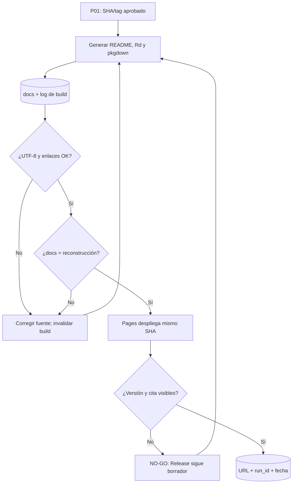

# P02 — Construcción y publicación de documentación/pkgdown

**ID estable:** `P02``n`n**Estado:** candidato operativo
**Propietario documental:** mantenedora de renoe

## Propósito y alcance

Generar y desplegar la documentación de usuarias desde las fuentes finales del mismo SHA de release. `docs/` es un derivado; esta ficha no define reglas analíticas.

## Usuario y responsable

Mantenedora documental y responsable de publicación web.

## Entrada canónica y productor

Fuentes `README.Rmd`, viñetas, roxygen, `_pkgdown.yml`, `inst/CITATION` y versión aprobada por P01.

## Pasos y decisiones

1. Regenerar README y Rd. 2. Construir pkgdown limpio. 3. Auditar UTF-8, enlaces, títulos, cita y referencia. 4. Confirmar que `docs/` coincide. 5. Desplegar el mismo SHA y verificar la URL.

## Salidas y consumidores

Sitio `docs/`, artefacto Pages y evidencia de URL. Consumen usuarias, P01 y soporte.

## Escenarios y perfiles aplicables

Documentación estable y hotfix documental. Una corrección editorial que cambia semántica vuelve a P01.

## Controles y compuertas GO/NO-GO

GO con 0 enlaces rotos, codificación limpia, versión coherente y URL pública actualizada. NO-GO si Pages informa éxito pero la cita o artículos siguen antiguos.

## Trazabilidad mínima

SHA/tag, run IDs de pkgdown y Pages, conteo HTML, fallos de enlace, URL y fecha de verificación.

## Dependencias y regla de invalidación descendente

Depende de P01. Cualquier cambio en README, cita, API, viñetas o `_pkgdown.yml` invalida el build y la comprobación pública.

## Reanudación y rollback

Conservar logs; reconstruir desde el SHA sin editar HTML. Rollback publicando en una nueva revisión el último `docs/` sano.

## Documentación que debe actualizarse

Viñetas para usuarias, `_pkgdown.yml`, manual de publicación y reporte de cierre.

## Historial de cambios

| Fecha | Versión de ficha | Cambio |
|---|---:|---|
| 2026-09-23 | 0.1 | Ficha inicial; formaliza compuertas, trazabilidad e invalidación. |

## Esquema reproducible

La fuente Mermaid es este bloque. Regeneración y validación: véase el [índice maestro](README.md#regeneración-y-validación-de-diagramas).
