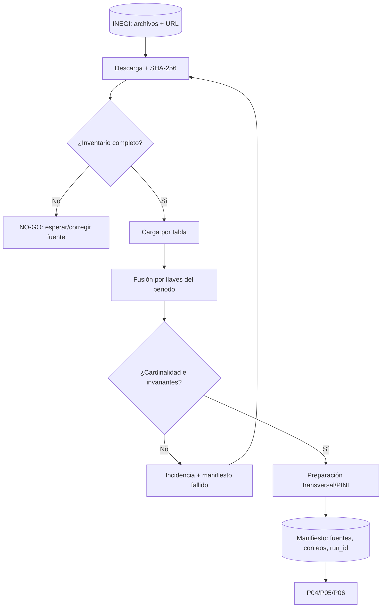

# P03 — Adquisición, carga, fusión y preparación ENOE

**ID estable:** `P03``n`n**Estado:** candidato operativo
**Propietario documental:** mantenedora de renoe

## Propósito y alcance

Obtener archivos ENOE, cargarlos, fusionar niveles y producir un transversal/PINI base con llaves e invariantes verificadas.

## Usuario y responsable

Equipo de datos ENOE; responsable de ingestión y revisión de calidad.

## Entrada canónica y productor

Publicaciones oficiales INEGI por año/trimestre, registradas con URL y hash. Productores: `descarga_enoe()`, `carga_enoe()`, `fusion_enoe()` y procesamiento base.

## Pasos y decisiones

1. Registrar disponibilidad. 2. Descargar y hashear. 3. Cargar tablas esperadas. 4. Fusionar con llaves del periodo. 5. Aplicar preparación base. 6. Evaluar invariantes y emitir manifiesto.

## Salidas y consumidores

Transversal/PINI base y manifiesto. Consumen P04, P05 y P06.

## Escenarios y perfiles aplicables

Periodo ordinario o excepción explícita. Para 2020-T1 rige la [nota canónica](../../inst/extdata/NOTA_CORRECCION_2020T1.md).

## Controles y compuertas GO/NO-GO

GO con archivos completos, llaves únicas según contrato, cardinalidades justificadas e invariantes aprobadas. NO-GO ante fuente cambiada sin hash, duplicados no explicados o pérdida de filas.

## Trazabilidad mínima

Periodo, versión renoe, SHA, run_id, URLs/hashes fuente, parámetros, conteos por tabla y manifiesto.

## Dependencias y regla de invalidación descendente

Una fuente o regla de fusión modificada invalida ese transversal y todos sus derivados P04–P08; aplicar P09 selectivamente.

## Reanudación y rollback

Reanudar desde el último archivo con hash verificado. Rollback al manifiesto anterior sin mezclar cachés.

## Documentación que debe actualizarse

Disponibilidad trimestral, excepciones de fusión, NEWS si cambia comportamiento y manifiesto de periodo.

## Historial de cambios

| Fecha | Versión de ficha | Cambio |
|---|---:|---|
| 2026-09-23 | 0.1 | Ficha inicial; formaliza compuertas, trazabilidad e invalidación. |

## Esquema reproducible

La fuente Mermaid es este bloque. Regeneración y validación: véase el [índice maestro](README.md#regeneración-y-validación-de-diagramas).
