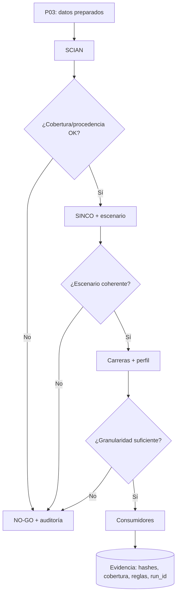

# P04 — Armonización SCIAN → SINCO → carreras y consumidores

**ID estable:** `P04``n`n**Estado:** candidato operativo
**Propietario documental:** mantenedora de renoe

## Propósito y alcance

Aplicar clasificadores en orden explícito, conservar procedencia/granularidad y entregar variables armonizadas a consumidores sin presentar reglas analíticas como equivalencias oficiales.

## Usuario y responsable

Equipo metodológico de clasificadores y responsables de consumidores.

## Entrada canónica y productor

Salida P03, diccionarios `inst/extdata` y contratos metodológicos. Productores: `armonizar_scian()`, `armonizar_sinco()` y `armonizar_carreras()`.

## Pasos y decisiones

1. Armonizar SCIAN. 2. Resolver SINCO con escenario declarado. 3. Armonizar carreras con perfil declarado. 4. Ejecutar consumidores. 5. Auditar cobertura, procedencia y remanentes.

## Salidas y consumidores

Datos clasificados y auditorías de cobertura; consumen P05, P06 y P07.

## Escenarios y perfiles aplicables

SINCO: `official_strict`, `integrated_accepted`, `analysis_legacy`. Carreras: `oficial`, `panel_validado`, `experimental`. Véase [metodología SINCO](../../inst/extdata/metodologia_cmo_sinco/NOTA_METODOLOGICA_ARMONIZACION_SINCO.md).

## Controles y compuertas GO/NO-GO

GO si escenario/perfil están declarados, códigos observados se preservan y consumidores aceptan la granularidad. NO-GO ante mezcla de escenarios o procedencia ausente.

## Trazabilidad mínima

Versión, SHA, run_id, hashes de diccionarios, escenario, perfil, cobertura y reglas aplicadas.

## Dependencias y regla de invalidación descendente

Cambiar un diccionario o precedencia invalida clasificaciones y todos los consumidores descendentes; consultar el [inventario](../../inst/extdata/metodologia_cmo_sinco/INVENTARIO_DEPENDENCIAS.md).

## Reanudación y rollback

Reanudar por etapa con entrada y hashes idénticos. Rollback al conjunto de diccionarios/manifiesto anterior.

## Documentación que debe actualizarse

Metodología/diccionarios canónicos, viñeta de migración, NEWS y contratos de consumidores.

## Historial de cambios

| Fecha | Versión de ficha | Cambio |
|---|---:|---|
| 2026-09-23 | 0.1 | Ficha inicial; formaliza compuertas, trazabilidad e invalidación. |

## Esquema reproducible

La fuente Mermaid es este bloque. Regeneración y validación: véase el [índice maestro](README.md#regeneración-y-validación-de-diagramas).
