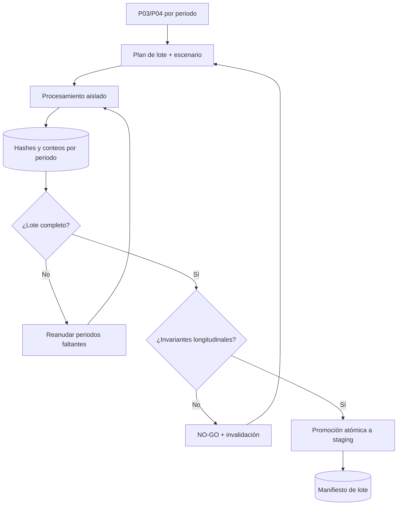

# P05 — Generación histórica, staging y controles de invariantes

**ID estable:** `P05``n`n**Estado:** candidato operativo
**Propietario documental:** mantenedora de renoe

## Propósito y alcance

Materializar series históricas por periodo en staging reproducible y evitar promover lotes incompletos o internamente incompatibles.

## Usuario y responsable

Equipo de producción histórica y control de calidad.

## Entrada canónica y productor

Salidas P03/P04 y manifiestos de fuente/clasificadores. Productor: corrida batch versionada.

## Pasos y decisiones

1. Definir rango y matriz de escenarios. 2. Procesar cada periodo aisladamente. 3. Registrar hashes/conteos. 4. Evaluar invariantes longitudinales. 5. Promover staging sólo como lote atómico.

## Salidas y consumidores

Staging histórico, reporte de invariantes y manifiesto de lote; consumen P06 y P07.

## Escenarios y perfiles aplicables

Un escenario homogéneo por lote; comparaciones entre escenarios se guardan como lotes distintos, nunca como mezcla.

## Controles y compuertas GO/NO-GO

GO si todos los periodos requeridos están presentes, invariantes y hashes pasan y el lote es atómico. NO-GO si hay huecos, mezcla de versiones o cambios inexplicados.

## Trazabilidad mínima

Rango temporal, versión/SHA, run_id padre e hijos, hashes de entrada/salida, escenario, conteos y manifiesto.

## Dependencias y regla de invalidación descendente

Un periodo invalidado por P03/P04 invalida el lote y sólo sus consumidores alcanzables. La regla exacta se registra en el grafo del manifiesto.

## Reanudación y rollback

Reanudar periodos fallidos con entradas idénticas; promover sólo al completar. Rollback cambiando el puntero de lote, sin sobrescribir el anterior.

## Documentación que debe actualizarse

Manifiesto de staging, reporte de invariantes, registro de excepciones y mapa de dependencias.

## Historial de cambios

| Fecha | Versión de ficha | Cambio |
|---|---:|---|
| 2026-09-23 | 0.1 | Ficha inicial; formaliza compuertas, trazabilidad e invalidación. |

## Esquema reproducible

La fuente Mermaid es este bloque. Regeneración y validación: véase el [índice maestro](README.md#regeneración-y-validación-de-diagramas).
