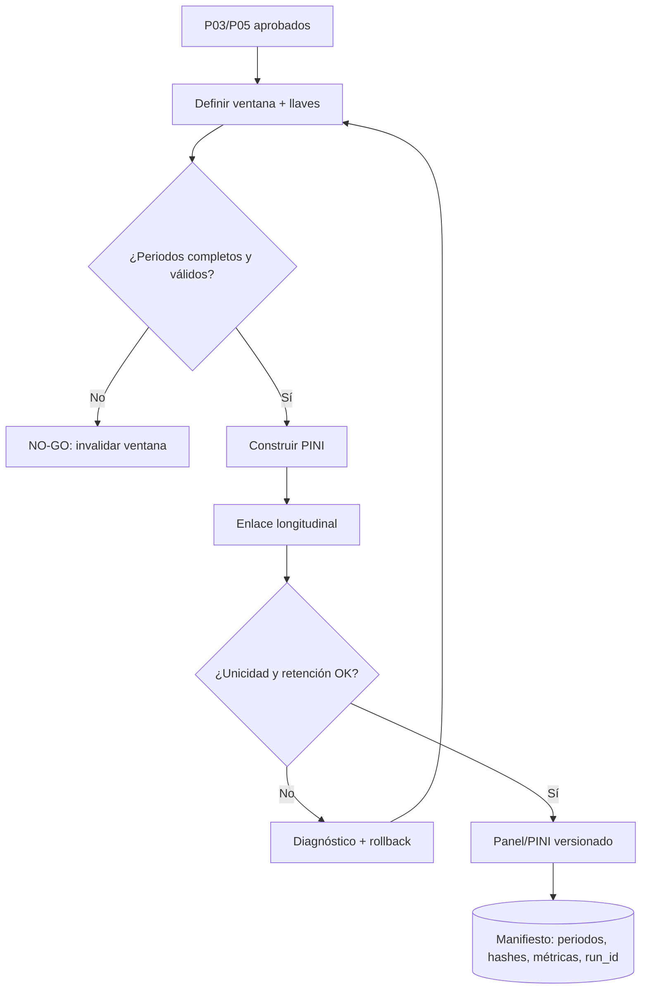

# P06 — Construcción de paneles y PINI

**ID estable:** `P06``n`n**Estado:** candidato operativo
**Propietario documental:** mantenedora de renoe

## Propósito y alcance

Construir PINI/transversales y paneles con ventanas y llaves reproducibles, preservando la relación con periodos fuente.

## Usuario y responsable

Equipo de paneles; responsable de llaves y revisión longitudinal.

## Entrada canónica y productor

P03/P05 aprobados, definición versionada de ventanas y llaves. Productor: pipeline de paneles registrado en el manifiesto.

## Pasos y decisiones

1. Seleccionar ventanas. 2. Validar disponibilidad de cada trimestre. 3. Construir PINI. 4. Enlazar personas/hogares. 5. Evaluar retención, unicidad y coherencia. 6. Publicar manifiesto.

## Salidas y consumidores

PINI y paneles numerados; consumen P07 y análisis longitudinales.

## Escenarios y perfiles aplicables

El escenario de clasificadores se hereda sin cambio. Ventana y definición de población son parámetros canónicos.

## Controles y compuertas GO/NO-GO

GO con ventanas completas, llaves únicas y métricas de retención dentro de umbrales documentados. NO-GO si un periodo está invalidado o la ventana mezcla builds.

## Trazabilidad mínima

Panel/PINI ID, periodos, versión/SHA, run_id, hashes de cada entrada/salida, parámetros y métricas.

## Dependencias y regla de invalidación descendente

Un trimestre corregido invalida todos los paneles que lo contienen. Para 2020-T1, véase la [nota de corrección](../../inst/extdata/NOTA_CORRECCION_2020T1.md).

## Reanudación y rollback

Reanudar por ventana desde staging inmutable. Rollback al manifiesto de panel anterior y retirar punteros a paneles inválidos.

## Documentación que debe actualizarse

Catálogo de paneles/PINI, definición de llaves/ventanas, manifiestos y notas de invalidación.

## Historial de cambios

| Fecha | Versión de ficha | Cambio |
|---|---:|---|
| 2026-09-23 | 0.1 | Ficha inicial; formaliza compuertas, trazabilidad e invalidación. |

## Esquema reproducible

La fuente Mermaid es este bloque. Regeneración y validación: véase el [índice maestro](README.md#regeneración-y-validación-de-diagramas).
