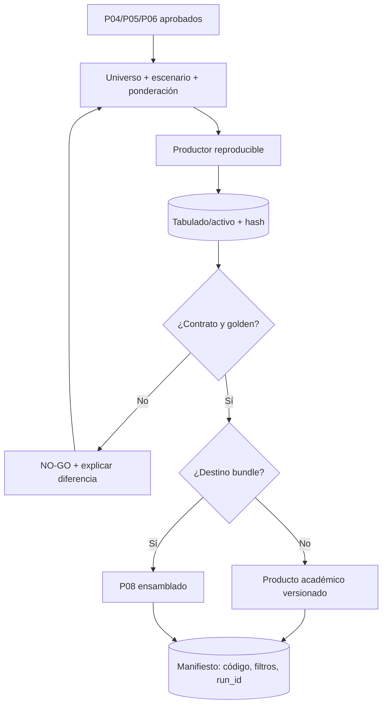

# P07 — Tabulados y productos académicos reproducibles

**ID estable:** `P07``n`n**Estado:** candidato operativo
**Propietario documental:** mantenedora de renoe

## Propósito y alcance

Producir tabulados y activos académicos con universo, ponderación y escenario explícitos, capaces de reproducirse desde entradas registradas.

## Usuario y responsable

Equipos de investigación, tabulados y revisión académica.

## Entrada canónica y productor

P04/P05/P06 aprobados. Para la ruta histórica autorizada rige el [contrato de productos académicos](../../inst/extdata/CONTRATO_PRODUCTOS_ACADEMICOS.md).

## Pasos y decisiones

1. Declarar pregunta/universo. 2. Elegir escenario y periodo/panel. 3. Ejecutar productor. 4. Comparar golden/invariantes. 5. Emitir tablas, metadatos y hashes.

## Salidas y consumidores

Tabulados, extractos y activos académicos; consumen publicaciones y P08.

## Escenarios y perfiles aplicables

`analysis_legacy` sólo para reproducción histórica autorizada; `integrated_accepted` para análisis general; `official_strict` para afirmaciones limitadas a evidencia oficial.

## Controles y compuertas GO/NO-GO

GO con contrato de columnas/escenario, ponderación y golden aprobados. NO-GO si falta universo, se mezcla escenario o cambia una cifra sin explicación.

## Trazabilidad mínima

Producto ID, versión/SHA, run_id, entrada/hash, escenario, filtros, ponderador, código y hash de salida.

## Dependencias y regla de invalidación descendente

Cambios P03–P06 invalidan sólo productos alcanzables según manifiesto. Ningún producto pasa a bundle sin contrato y equivalencia.

## Reanudación y rollback

Reanudar desde entrada inmutable y semilla/parámetros registrados. Rollback a producto previo, conservando ambos hashes.

## Documentación que debe actualizarse

Contrato del producto, diccionario, metodología, tabla de resultados y registro de revisión.

## Historial de cambios

| Fecha | Versión de ficha | Cambio |
|---|---:|---|
| 2026-09-23 | 0.1 | Ficha inicial; formaliza compuertas, trazabilidad e invalidación. |

## Esquema reproducible

La fuente Mermaid es este bloque. Regeneración y validación: véase el [índice maestro](README.md#regeneración-y-validación-de-diagramas).
