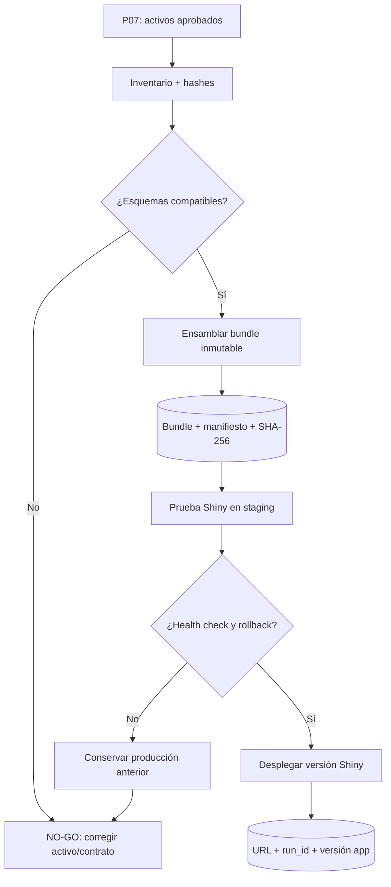

# P08 — Ensamblado de bundle, actualización y despliegue Shiny

**ID estable:** `P08``n`n**Estado:** candidato operativo
**Propietario documental:** mantenedora de renoe

## Propósito y alcance

Ensamblar activos aprobados en un bundle inmutable y desplegar Shiny sin confundir la versión del paquete con la de la aplicación o los datos.

## Usuario y responsable

Responsable de activos y responsable de operación Shiny.

## Entrada canónica y productor

Productos P07 aprobados y contrato de bundle versionado. El [contrato académico](../../inst/extdata/CONTRATO_PRODUCTOS_ACADEMICOS.md) aclara que su salida aún no es un bundle publicable.

## Pasos y decisiones

1. Resolver inventario. 2. Verificar hashes/esquemas. 3. Ensamblar bundle. 4. Probar en staging. 5. Desplegar versión Shiny. 6. Ejecutar health check y conservar rollback.

## Salidas y consumidores

Bundle, manifiesto, versión Shiny y evidencia de despliegue; consumen la aplicación y usuarias.

## Escenarios y perfiles aplicables

Un bundle declara un único perfil compatible por activo. Shiny y datos siguen versiones separadas del paquete.

## Controles y compuertas GO/NO-GO

GO con hashes, esquemas, prueba de staging y health check. NO-GO si falta un activo, hay incompatibilidad o no existe rollback.

## Trazabilidad mínima

Bundle/app version, commit, run_id, hashes de activos/bundle, URL staging/producción, fecha y responsable.

## Dependencias y regla de invalidación descendente

Cualquier activo P07 invalidado invalida los bundles que lo incluyen y despliegues dependientes. No invalida automáticamente el release del paquete.

## Reanudación y rollback

Reanudar ensamblado desde activos inmutables. Rollback apuntando Shiny al último bundle sano y verificando health check.

## Documentación que debe actualizarse

Contrato e inventario de bundle, changelog Shiny, matriz de compatibilidad, runbook y registro de despliegue.

## Historial de cambios

| Fecha | Versión de ficha | Cambio |
|---|---:|---|
| 2026-09-23 | 0.1 | Ficha inicial; formaliza compuertas, trazabilidad e invalidación. |

## Esquema reproducible

La fuente Mermaid es este bloque. Regeneración y validación: véase el [índice maestro](README.md#regeneración-y-validación-de-diagramas).
