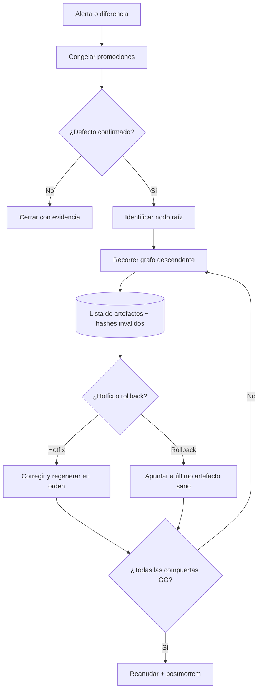

# P09 — Corrección selectiva, hotfix, invalidación descendente y rollback

**ID estable:** `P09``n`n**Estado:** candidato operativo
**Propietario documental:** mantenedora de renoe

## Propósito y alcance

Contener errores, identificar alcance, invalidar sólo descendientes afectados y restaurar servicio o datos sin borrar evidencia.

## Usuario y responsable

Responsable del incidente, dueñas de procesos afectados y mantenedora de release cuando corresponda.

## Entrada canónica y productor

Incidente reproducible, manifiestos P01–P08 y grafo de dependencias. Productor: detección automática o reporte validado.

## Pasos y decisiones

1. Congelar promociones. 2. Confirmar defecto y raíz. 3. Recorrer dependencias. 4. Marcar inválidos. 5. Elegir corrección, hotfix o rollback. 6. Regenerar y cerrar con evidencia.

## Salidas y consumidores

Registro de incidente, conjunto invalidado, artefactos corregidos y postmortem; consumen todos los procesos alcanzados.

## Escenarios y perfiles aplicables

Corrección de datos, hotfix de paquete, rollback web/Shiny o release retrospectivo. Cada uno conserva artefactos históricos.

## Controles y compuertas GO/NO-GO

GO para reanudar sólo cuando raíz corregida, descendientes regenerados y verificaciones pasan. NO-GO si el alcance o hashes siguen incompletos.

## Trazabilidad mínima

Incident ID, versión/SHA, run_ids, artefactos/hashes afectados, grafo recorrido, decisión, responsables y tiempos.

## Dependencias y regla de invalidación descendente

La invalidación sigue aristas del manifiesto desde el nodo defectuoso; no se invalida por proximidad nominal. Las excepciones requieren justificación firmada.

## Reanudación y rollback

Reanudar por orden topológico desde el primer nodo válido. Rollback cambia punteros/versiones, nunca sobrescribe ni mueve tags públicos.

## Documentación que debe actualizarse

Incidente, postmortem, NEWS/nota de corrección si aplica, manifiestos y estado de cada consumidor.

## Historial de cambios

| Fecha | Versión de ficha | Cambio |
|---|---:|---|
| 2026-09-23 | 0.1 | Ficha inicial; formaliza compuertas, trazabilidad e invalidación. |

## Esquema reproducible

La fuente Mermaid es este bloque. Regeneración y validación: véase el [índice maestro](README.md#regeneración-y-validación-de-diagramas).
