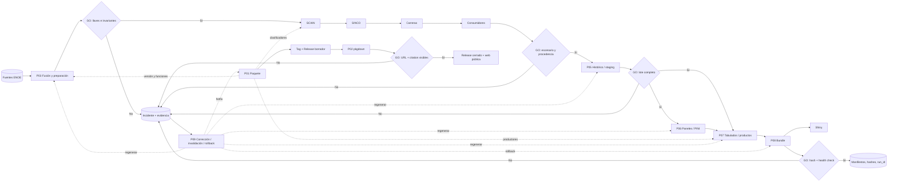

# Mapa de grandes procesos de renoe

Esta documentación es operativa y está dirigida a mantenedoras. La documentación de usuarias vive en `README.Rmd`, `vignettes/` y pkgdown; `docs/` es salida generada y no se edita manualmente.

## Procesos

| ID | Proceso | Resultado principal |
|---|---|---|
| [P01](P01-paquete-release.md) | Desarrollo y publicación del paquete renoe | Tarball, tag y Release verificables |
| [P02](P02-documentacion-pkgdown.md) | Construcción/publicación de documentación/pkgdown | Sitio público coherente con el release |
| [P03](P03-adquisicion-preparacion-enoe.md) | Adquisición, carga, fusión y preparación ENOE | Transversal/PINI base y manifiesto |
| [P04](P04-armonizacion-clasificadores.md) | SCIAN → SINCO → carreras y consumidores | Clasificaciones trazables |
| [P05](P05-historico-staging-invariantes.md) | Generación histórica/staging e invariantes | Lote histórico aprobado |
| [P06](P06-paneles-pini.md) | Paneles y PINI | Paneles longitudinales versionados |
| [P07](P07-tabulados-productos-academicos.md) | Tabulados y productos académicos | Productos reproducibles |
| [P08](P08-bundle-shiny.md) | Bundle y despliegue Shiny | Bundle/app con rollback |
| [P09](P09-correccion-hotfix-rollback.md) | Corrección, hotfix, invalidación y rollback | Recuperación con alcance trazable |

## Diagrama maestro



## Estándar común de las fichas

Todas las fichas usan el mismo orden: propósito/alcance; usuario/responsable; entrada canónica/productor; pasos/decisiones; salidas/consumidores; escenarios/perfiles; GO/NO-GO; trazabilidad; dependencias/invalidación; reanudación/rollback; documentación; historial; esquema reproducible.

Las reglas sustantivas se mantienen en sus contratos canónicos y sólo se enlazan. Referencias centrales:

- [Manual de publicación](../MANUAL_PUBLICACION.md).
- [Contrato de productos académicos](../../inst/extdata/CONTRATO_PRODUCTOS_ACADEMICOS.md).
- [Nota de corrección 2020-T1](../../inst/extdata/NOTA_CORRECCION_2020T1.md).
- [Inventario de dependencias SINCO](../../inst/extdata/metodologia_cmo_sinco/INVENTARIO_DEPENDENCIAS.md).
- [Metodología de armonización SINCO](../../inst/extdata/metodologia_cmo_sinco/NOTA_METODOLOGICA_ARMONIZACION_SINCO.md).

## Regeneración y validación de diagramas

La fuente de cada diagrama es el bloque `mermaid` versionado en Markdown; nunca una captura ni un PNG. Para validación estructural y de enlaces:

```sh
Rscript tools/development/verificar_procesos.R
```

Si `mmdc` (Mermaid CLI) está disponible en un entorno reproducible y fijado, cada bloque puede exportarse a SVG con una versión registrada de Mermaid. En esta candidata `mmdc` no está instalado, por lo que no se añaden SVG potencialmente irreproducibles. Los diagramas internos y publicables comparten la misma fuente Markdown; P01–P02 pueden publicarse como guía de gobernanza y P03–P09 permanecen internos hasta revisar que sus rutas, contratos y umbrales no expongan infraestructura o decisiones pendientes.

## Regla de cambio

Todo cambio de proceso actualiza su ficha, historial y, si cambia una arista, el diagrama maestro. Si cambia una regla analítica, se modifica primero el contrato canónico y después el enlace; no se copia la regla en varias fichas.
